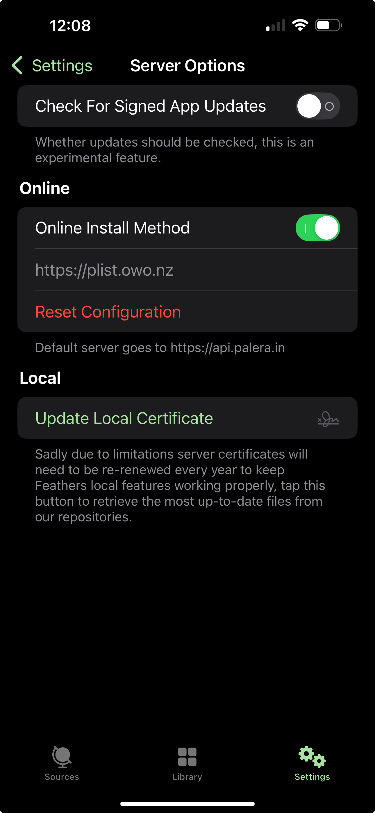

# Plist Server for Vercel

Plist Server is a simple server that designed for [khcrysalis/Feather](https://github.com/khcrysalis/Feather) and deployed on Vercel.

## Set up on Feather

1. Open Feather App settings

2. Choose "Server Options"

3. Choose "Use Custom Server"

4. Turn on "Online Install Method"

5. Restart Feather App

6. Done!

## Credits

- [missuo/plistserver](https://github.com/missuo/plistserver)
- [nekohaxx/plistserver](https://github.com/nekohaxx/plistserver)
